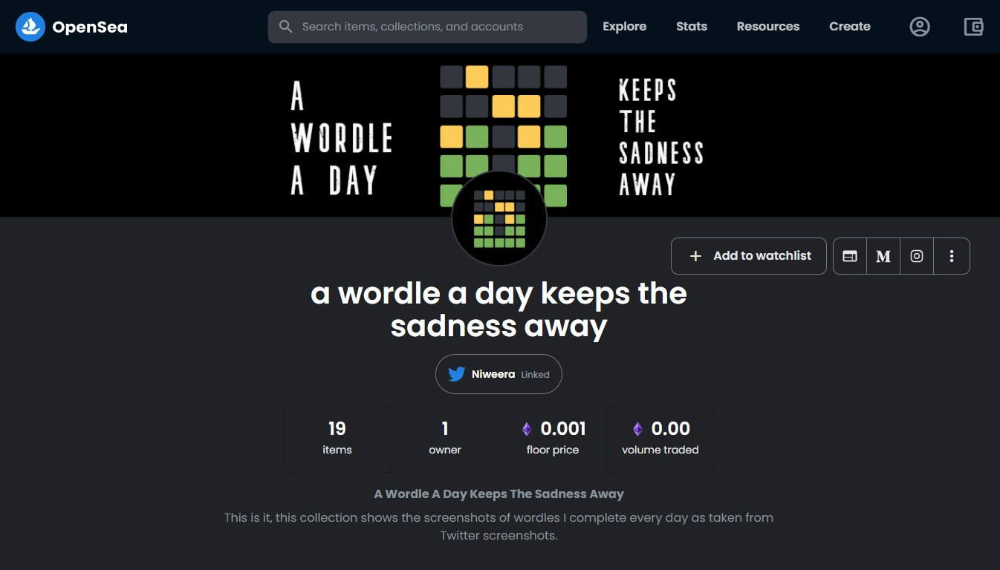
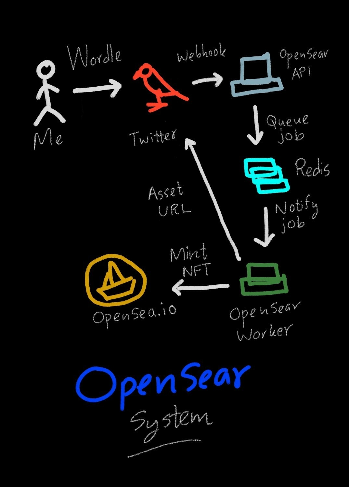
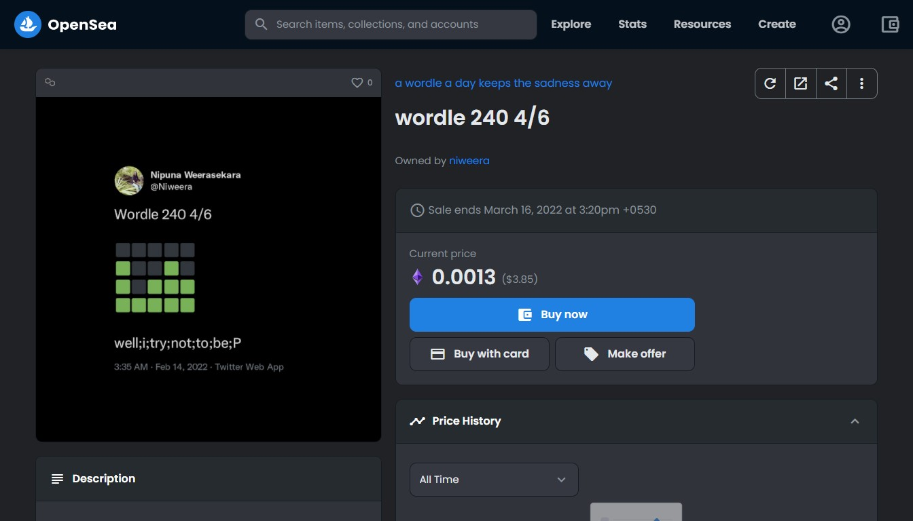

[](https://deepsource.io/gh/Niweera/opensear/?ref=repository-badge)

# OpenSear

**OpenSear** is a system that helps me to mint and list my NFTs on [opensea.io](https://opensea.io) marketplace.

The story behind the **OpenSear** system is discussed in three part limited article series. Read it from the following links.

[How I Automated Minting My Tweets as NFTs on OpenSea](https://medium.com/@niweera/how-i-automated-minting-my-tweets-as-nfts-on-opensea-854c50a44467)

[How I Automated Minting My Tweets as NFTs on OpenSea — Part 2](https://medium.com/@niweera/how-i-automated-minting-my-tweets-as-nfts-on-opensea-part-2-662fcb52c45c)

[How I Automated Minting My Tweets as NFTs on OpenSea — Part 3](https://medium.com/@niweera/how-i-automated-minting-my-tweets-as-nfts-on-opensea-part-3-9464d2652cc0)

Check out my NFT collection [a wordle a day keeps the sadness away](https://opensea.io/collection/wordle-keeps-sadness-away).



## Architecture

**OpenSear** is consisted of two separate systems, **OpenSear-API** (_opensear_) and **OpenSear-Worker** (_opensearobot_). The following is a high-level architecture of OpenSear system.



When a user tweets a specific tweet (in this case a tweet of a [wordle](https://www.nytimes.com/games/wordle/index.html)), the webhook created using [Twitter Account Activity API](https://developer.twitter.com/en/docs/twitter-api/premium/account-activity-api/overview) will send the payload to [OpenSear-API](https://opensear.niweera.gq). The OpenSear-API will queue a job in a Redis server using [Bull](https://github.com/OptimalBits/bull) and OpenSear-Worker will be notified of this job. 

OpenSear-Worker will obtain a screenshot of the tweet (notified via the webhook payload) using [TweetPik Twitter Screenshot API](https://tweetpik.com/twitter-screenshot-api). The TweetPik screenshot has a watermark (luckily it's position is predictable) and the watermark is removed using [Jimp](https://github.com/oliver-moran/jimp) library. Then the watermark removed tweet screenshot is ready for minting an NFT and listing on [OpenSea.io](https://opensea.io) platform.

Since [OpenSea.io](https://opensea.io) platform does not have an API for creating assets, the [puppeteer](https://www.npmjs.com/package/puppeteer) will automate the task and mint the NFT. The OpenSear-Worker will launch a [puppeteer](https://www.npmjs.com/package/puppeteer) browser, and it will be authenticated for [MetaMask](https://metamask.io/) using [@chainsafe/dappeteer](https://www.npmjs.com/package/@chainsafe/dappeteer) and finally the NFT is minted. Finally, OpenSear-Worker will reply the original tweet with the OpenSea.io marketplace asset URL for the minted NFT. This is where the OpenSear-Worker concludes its tasks. Then I manually list them by quoting a price later 😁.

## Install Steps

```bash
# Install Xvfb and supported packages
$ sudo apt-get install -y xvfb libgbm-dev libxkbcommon-x11-0 libgtk-3-0
$ npm install
```

## Start OpenSear-API

```bash
$ pm2 start --name "opensear" npm -- start
```
## Start OpenSear-Worker

```bash
$ pm2 start --name "opensearobot" npm -- run worker
```

## OpenSear in action

### On [OpenSea.io marketplace](https://opensea.io/assets/matic/0x2953399124f0cbb46d2cbacd8a89cf0599974963/3174924704537354725776608230933781217533108654819823768175757884922791985153)



### On [Twitter](https://twitter.com/Niweera/status/1493156992588062721)


## Acknowledgement

Special thanks to all the people who wrote code that I took some inspiration 😉. Specially [this guy](https://medium.com/@andre.rabold) for his [wonderful article](https://levelup.gitconnected.com/how-to-mint-100-000-nfts-for-free-62d83888ff6) and [code](https://github.com/arabold/opensea-uploader).

No idea what NFTs are? Me neither 🤷‍♂️. Check [this video](https://www.youtube.com/watch?v=meTpMP0J5E8) out.
